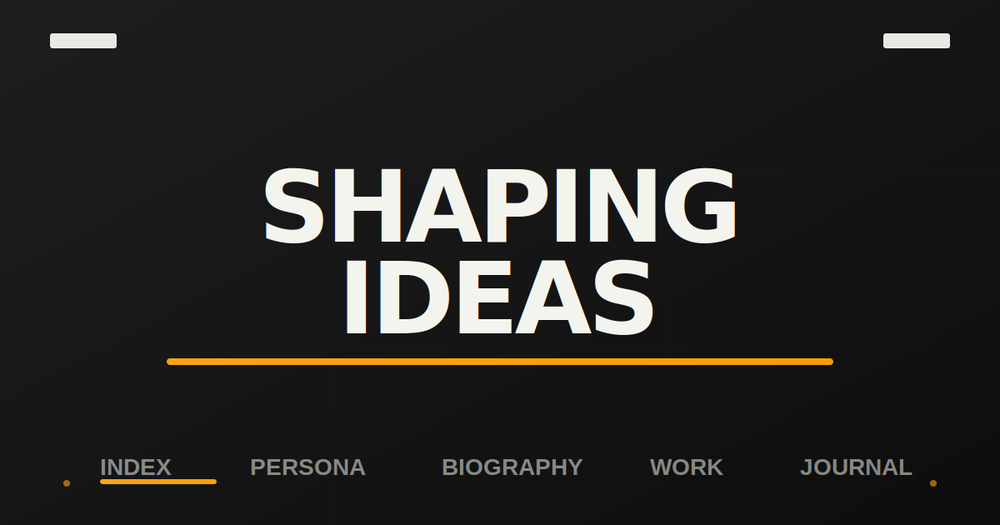
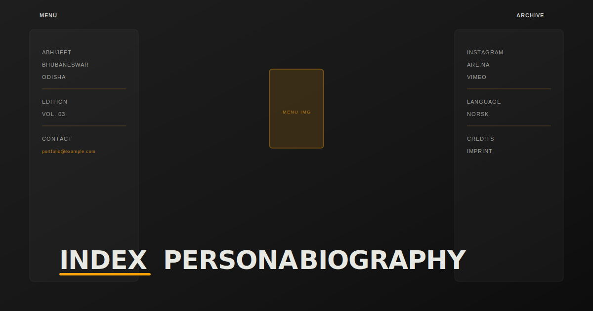

<div align="center">



<br/>

# ✦ JamArea Portfolio Design

**A cinematic, GSAP-powered animated menu experience — Vol. 03**

<br/>

[](https://developer.mozilla.org/en-US/docs/Web/HTML)
[](https://developer.mozilla.org/en-US/docs/Web/CSS)
[](https://developer.mozilla.org/en-US/docs/Web/JavaScript)
[](https://greensock.com/gsap/)

[](LICENSE)
[](https://github.com/noobcoder1982/JamAreaPortfolioDesign/commits/main)
[](https://github.com/noobcoder1982/JamAreaPortfolioDesign)

<br/>

[**🔴 Live Demo**](#-deployment) · [**📦 Get Started**](#-getting-started) · [**✨ Features**](#-features) · [**📸 Screenshots**](#-screenshots)

</div>

---

## 📋 Table of Contents

| # | Section |
|---|---------|
| 1 | [✨ Features](#-features) |
| 2 | [🛠 Tech Stack](#-tech-stack) |
| 3 | [📸 Screenshots](#-screenshots) |
| 4 | [🚀 Getting Started](#-getting-started) |
| 5 | [📁 Project Structure](#-project-structure) |
| 6 | [🎨 Customization](#-customization) |
| 7 | [🌐 Deployment](#-deployment) |
| 8 | [🗺 Roadmap](#-roadmap) |
| 9 | [🤝 Contributing](#-contributing) |
| 10 | [📄 License](#-license) |
| 11 | [🙏 Credits](#-credits) |

---

## ✨ Features

- 🎬 **Cinematic menu overlay** — clip-path reveal animation with `expo.out` easing
- 🔤 **Character-level text animation** — GSAP `SplitText` splits each link into individual animated characters
- 🖱 **Cursor-tracked horizontal scroll** — menu links glide left/right following the mouse position with smooth lerping
- 🟡 **Animated link highlighter** — an accent-coloured bar smoothly slides and resizes under the active link
- 🌗 **Blend-mode nav** — fixed navigation uses `mix-blend-mode: difference` for a striking light/dark contrast
- 📱 **Mobile-aware** — hover and cursor effects are disabled below 1000 px for a clean mobile experience
- ⚡ **Zero build step** — drop-in HTML file, no bundler or framework required

---

## 🛠 Tech Stack

| Layer | Technology |
|-------|-----------|
| **Markup** | HTML5 |
| **Styling** | CSS3 — custom properties, clip-path, flexbox |
| **Scripting** | Vanilla JavaScript (ES6+) |
| **Animation** | [GSAP 3](https://greensock.com/gsap/) + [SplitText](https://greensock.com/splittext/) |
| **Typography** | Google Fonts — *Anton*, *DM Sans* |

---

## 📸 Screenshots

<div align="center">

### 🏠 Hero View


<br/><br/>

### 📂 Menu Open


</div>

> **Tip:** Replace the SVG previews above with real browser screenshots once you have them. Drop `.png` files into `assets/screenshots/` and update the `src` paths.

---

## 🚀 Getting Started

### Prerequisites

- Any modern web browser (Chrome, Firefox, Edge, Safari)
- No Node.js, npm, or build tools required

### Installation

```bash
# 1. Clone the repository
git clone https://github.com/noobcoder1982/JamAreaPortfolioDesign.git

# 2. Enter the project directory
cd JamAreaPortfolioDesign
```

### Run Locally

```bash
# Option A — just open the file directly
open index.html          # macOS
start index.html         # Windows
xdg-open index.html      # Linux
```

```bash
# Option B — serve with a lightweight dev server (recommended for font loading)
npx serve .
# or
python -m http.server 8080
```

Then visit **http://localhost:8080** (or the port shown) in your browser.

---

## 📁 Project Structure

```
JamAreaPortfolioDesign/
│
├── index.html              ← Single-page app (markup + inline styles + GSAP script)
├── styles.css              ← Standalone stylesheet (mirrors inline styles)
├── script.js               ← Standalone JS (mirrors inline script)
├── menu_img.jpg            ← Centred menu image asset
│
└── assets/
    └── screenshots/        ← README preview images
        ├── preview.svg
        └── menu-open.svg
```

---

## 🎨 Customization

<details>
<summary><strong>🎨 Change the colour palette</strong></summary>

Edit the CSS custom properties at the top of `index.html` (or `styles.css`):

```css
:root {
  --dark:   #1e1e1e;   /* background / text dark */
  --light:  #fefff8;   /* background / text light */
  --accent: #fca311;   /* highlight bar & decorative accents */
}
```
</details>

<details>
<summary><strong>🔤 Change the hero headline</strong></summary>

In `index.html`, find the hero section and update the text:

```html
<section class="hero">
  <h1>Your New Headline</h1>
</section>
```
</details>

<details>
<summary><strong>📋 Add / remove menu links</strong></summary>

Duplicate or remove a `.menu-link` block inside `.menu-links-wrapper`:

```html
<div class="menu-link">
  <a>
    <span>New Page</span>
    <span>New Page</span>  <!-- duplicate for hover animation -->
  </a>
</div>
```
</details>

<details>
<summary><strong>⚡ Adjust animation speed</strong></summary>

Search for `duration:` values in the `toggleMenu()` function inside `script.js` (or the inline `<script>`) and change numbers to taste. The `lerpFactor` variable (default `0.05`) controls how smoothly the links follow the cursor.
</details>

---

## 🌐 Deployment

Because this is a **zero-dependency static site**, you can deploy it anywhere:

| Platform | Steps |
|----------|-------|
| **GitHub Pages** | Settings → Pages → Source: `main` branch `/` (root) |
| **Netlify** | Drag & drop the repo folder on [netlify.com/drop](https://app.netlify.com/drop) |
| **Vercel** | `npx vercel` in the project directory |
| **Surge** | `npx surge . your-subdomain.surge.sh` |

---

## 🗺 Roadmap

- [ ] Add real full-page screenshots to `assets/screenshots/`
- [ ] Implement page-level routing (Index / Persona / Biography / Work / Journal)
- [ ] Add touch / swipe support for mobile menu
- [ ] Dark ↔ light theme toggle
- [ ] Accessibility improvements (keyboard navigation, `aria-*` attributes)

---

## 🤝 Contributing

Contributions are welcome! ❤️

```bash
# 1. Fork the repo
# 2. Create a feature branch
git checkout -b feature/amazing-feature

# 3. Commit your changes
git commit -m "Add amazing feature"

# 4. Push to your fork
git push origin feature/amazing-feature

# 5. Open a Pull Request against main
```

Please follow the existing code style and keep PRs focused.

---

## 📄 License

Distributed under the **MIT License**. See [`LICENSE`](LICENSE) for more information.

---

## 🙏 Credits

| Resource | Link |
|----------|------|
| **GSAP** animation library | [greensock.com](https://greensock.com/gsap/) |
| **SplitText** plugin | [greensock.com/splittext](https://greensock.com/splittext/) |
| **Google Fonts** (Anton, DM Sans) | [fonts.google.com](https://fonts.google.com/) |
| Original design inspiration | [Codegrid](https://www.youtube.com/@Codegrid) |
| Built by | **Abhijeet** — Bhubaneswar, Odisha |

---

<div align="center">

Made with ❤️ and ☕ by **Abhijeet**

⭐ **Star this repo** if you found it inspiring!

</div>
